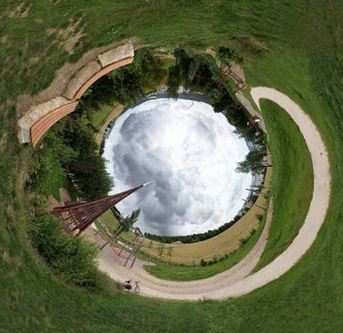
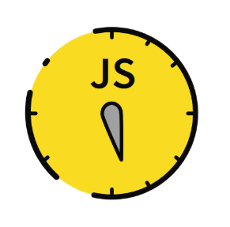

# 关于博客

这里是`ConardLi`写博客的地方，您也可以在下面的地方关注我。

<a href="https://juejin.im/user/5bea27965188250edf4ad8b7" class="item" >
  
  
     掘金
  
</a>

<a href="https://segmentfault.com/u/conardli" class="item" >
  
  
     segmentfault
  
</a>

<a href="https://mp.weixin.qq.com/s/dYZEHTgqvxGV7mL99JuxRQ" class="item" >
  
  
     微信公众号
  
</a>

博客使用`hexo + github Page`搭建，主题使用了`hueman`。

- [个人博客搭建及配置总结](#)

# 博客导航

## JavaScript深入

重新写作中...

## React
- [【React深入】setState的执行机制](https://www.lisq.xyz/2019/03/06/%E3%80%90React%E6%B7%B1%E5%85%A5%E3%80%91setState%E7%9A%84%E6%89%A7%E8%A1%8C%E6%9C%BA%E5%88%B6/)
- [【React深入】React事件机制](https://www.lisq.xyz/2019/03/06/%E3%80%90React%E6%B7%B1%E5%85%A5%E3%80%91setState%E7%9A%84%E6%89%A7%E8%A1%8C%E6%9C%BA%E5%88%B6/)
- [【React深入】react中key的正确使用方式](https://www.lisq.xyz/2018/11/27/react%E4%B8%ADkey%E7%9A%84%E6%AD%A3%E7%A1%AE%E4%BD%BF%E7%94%A8%E6%96%B9%E5%BC%8F/)

## 浏览器和网络

- [前端开发者必备的nginx知识]()

## 前端工程

- [全面分析前端的网络请求方式]()
- webpack从原理到使用
- 深入理解git
- React PC 脚手架工程搭建
- React Native PC 脚手架工程搭建

## electron

- [electron程序保护措施（崩溃监控，开机自启，托盘关闭）](https://www.lisq.xyz/2018/11/07/electron%E7%A8%8B%E5%BA%8F%E4%BF%9D%E6%8A%A4%E6%8E%AA%E6%96%BD%EF%BC%88%E5%B4%A9%E6%BA%83%E7%9B%91%E6%8E%A7%EF%BC%8C%E5%BC%80%E6%9C%BA%E8%87%AA%E5%90%AF%EF%BC%8C%E6%89%98%E7%9B%98%E5%85%B3%E9%97%AD%EF%BC%89/)
- [使用electron静默打印](https://www.lisq.xyz/2018/11/01/%E4%BD%BF%E7%94%A8electron%E9%9D%99%E9%BB%98%E6%89%93%E5%8D%B0/)
- [指令控制 windows 电源选项](https://www.lisq.xyz/2018/12/17/%E6%8C%87%E4%BB%A4%E6%8E%A7%E5%88%B6-windows-%E7%94%B5%E6%BA%90%E9%80%89%E9%A1%B9/)

## 算法和数据结构

为获得更好的阅读体验，本模块已迁移到[awesome-coding-js](https://github.com/ConardLi/awesome-coding-js)

# 友情链接

<a href="https://github.com/ConardLi/tpanorama" class="item item2" >
  
  
     tpanorama
  
</a>

<a href="https://github.com/ConardLi/electron-react" class="item item2" >
  
  
     electron-react
  
</a>

<a href="https://github.com/ConardLi/30-seconds-of-code-Zh-CN" class="item item2" >
  
  
     30second
  
</a>

# 版权声明

所有原创文章（除翻译文章外的所有文章）的著作权属于 **ConardLi**

转载注意事项：

你可以在非商业的前提下免费转载，但同时你必须：

- 明确署名，即至少注明 作者：ConardLi 字样以及文章的原始链接。

如需商业合作，请直接联系作者。

# 推荐关注

每日推送精品文章，免费领取大量资料教程。

 

